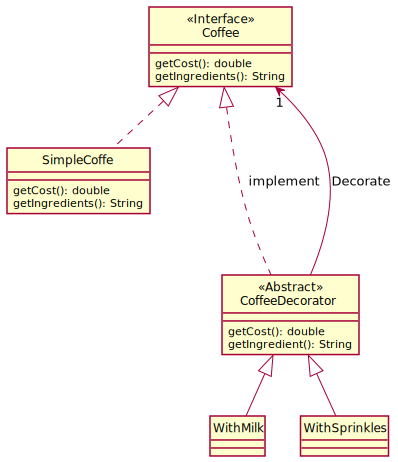
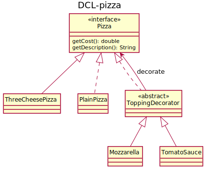
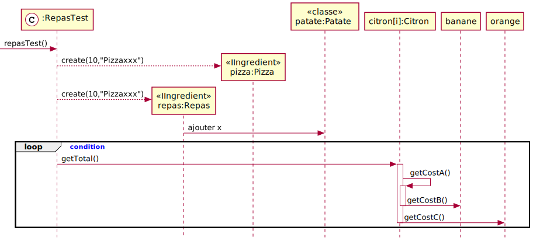

# Patron Décorateur

[Identifidation de l'étudiant](README-identification.md)

# Travail pratique à réaliser
1. Vous devez compléter le/les test(s) dans la classe RepasTest
1. repas.getCost() doit nécessairement utiliser un Itérateur 
2. Faire un diagramme de classe
3. Faire un diagramme de séquence de la fonction repasTest() en excluant les assert
4. Ajouter le détail de l'opération getCost() sur le mozzarella dans votre diagramme de séquence et démontrer la mécanique de décoration.
5. Ajouter le détail de l'opération repas.getCost() dans votre diagramme de séquence.

  
# Diagramme de classe
Créer un seul diagramme de classe englobant toutes les classes de ce projet.
Votre solution doit respecter les contraintes suivante:
1. SimpleCoffee peut être décorer seulement par
   - withMilk
   - WithSprinkles
2. Patate peut être décorer seulement par 
    - Sauce
    - Poulet (a ajouter)
3. PlainPizza peut etre décoré seulement par
    - Mozarrelle
    - TomatoSauce

Diagramme extrait des projets précédents.... 

# Diagramme de séquence du test RapasTest.java
Voici un exemple de diagramme de séquence avec plantUML

Je vous suggère d'éditer les diagrammes dans le fichier README.puml. Utiliser le menu contextuel "Export current file diagrams" qui exportera les fichier svg dans le répertoir out. Vous n'avez qu'a mettre les liens approprié dans ce fichier et vous avez vos diagramme dans votre readme.  Cette méthode facilite grandement la mise à jours des diagrammes et de ce fichier.