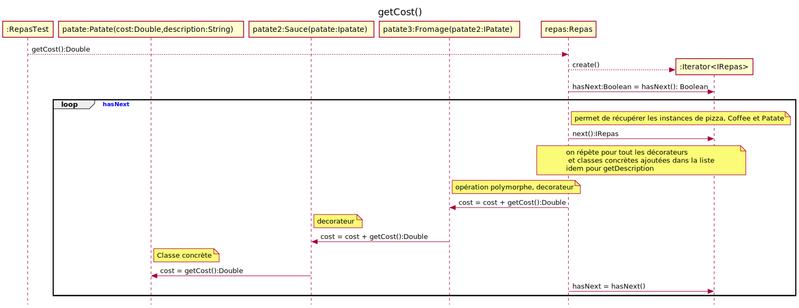

# Patron Décorateur

[Identifidation de l'étudiant](README-identification.md)

## Travail pratique à réaliser
1. Vous devez enlever les commentaires et faire les modifications nécessaires dans le code et dans le fichier de test RepasTest.java pour faire passer
celui-ci et calculer le cout total du repas.   
1. repas.getCost() doit nécessairement utiliser un <u>Itérateur</u> 
2. repas.getDescription() doit nécessairement utiliser un <u>Itérateur</u> 
3. Faire un diagramme de classe
4. Faire un diagramme de séquence de la fonction repasTest() en excluant les assert
5. Votre diagramme de séquence doit démontrer l'utilisation de l'itérateur pour l'opération getCost() seulement.

  
## Diagramme de classe
Insérer votre diagramme ici

Diagramme extrait des projets précédents.... 

## Diagramme de séquence du test RapasTest.java

Je vous suggère d'éditer les diagrammes dans le fichier README.puml. Utiliser le menu contextuel "Export current file diagrams" qui exportera les fichier svg dans le répertoir out. Vous n'avez qu'a mettre les liens approprié dans ce fichier et vous avez vos diagramme dans votre readme.  Cette méthode facilite grandement la mise à jours des diagrammes et de ce fichier et permet la visualisation complète du fichier REAME.md sur github à l'aide d'un navigateur.

java -jar plantuml-dependency-cli-1.4.0-jar-with-dependencies.jar -o src/main/java/Decorateur/Repas/README-generated.puml -b . -i **/Decorateur/**/*.java  -v